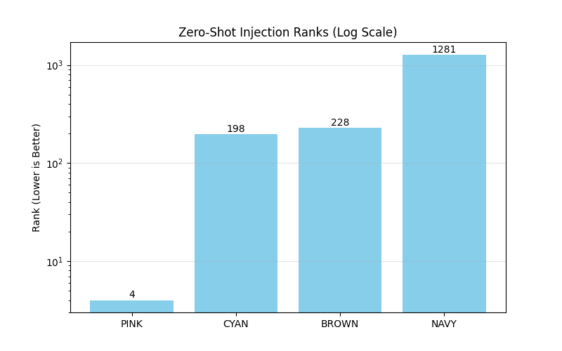

# Augmented Latent State Injection (ALSI)

> [!CAUTION]
> **Research Artifact Disclaimer**: This repository documents exploratory research into Mamba-2 state dynamics. It is **not** a production-ready framework or a memory system. 
> 
> **CRITICAL TECHNICAL WARNING:**
> *   🚩 **DO NOT USE `MockCache`**: It causes catastrophic logit divergence (~69.5) and invalidates results.
> *   ✅ **USE `functional_mamba_step`**: All differentiable steering must use the functional implementation in `core/`.

> **"Logit control ≠ trajectory control"**

This repository explores whether Mamba-2 State Space Models can be steered via learned non-linear latent perturbations, analogous to activation steering in Transformers. We investigate the constraints imposed by recurrent dynamics and the engineering challenges of functional differentiation.

---

## Technical Status: Exploratory Research

### 1. The "Two-System" Hypothesis (Falsified)
Earlier claims of a "Safety Reflex" were proven to be **technical artifacts** of cache misalignment. With proper functional state management, the model does not "refuse" injections, though it may collapse into hallucinations.

### 2. Control vs. Coherence (The Gap)
We achieved **Rank 1 Control** (forcing specific immediate tokens) across diverse prompts. However, maintaining long-term trajectory coherence remains an open problem.
*   **Late Layer Injection (L23):** Forces token but shatters manifold (loops/garbage).
*   **Optimal Depth (L16):** Best balance of control authority and partial context recovery.
*   **Trajectory Shaping:** Multi-step optimization reduces looping but does not yet yield grammatical text.

---

## Key Breakthroughs

*   **Functional Recurrence:** A pure PyTorch implementation of the Mamba-2 step, enabling backpropagation through time (BPTT) for state optimization.
*   **Spatio-Temporal Mapping:** Discovery of the "Phase Diagram" of control stability and identifying Layer 16 as the optimal steering depth.
*   **Loop Mitigation:** Proving that multi-step objectives can break the "Sticky Attractor" limit cycles.

---

## Limitations & Risks

*   ❌ **No Coherent Generation:** Injected states currently result in garbled fallbacks or hallucinations after the forced token.
*   ❌ **Context Sensitivity:** The current Phi projector is highly sensitive to the initial prompt manifold.
*   ⚠️ **Security Risk:** This technique, if scaled, represents a potential vector for model hijacking or jailbreaking. See `docs/reports/Limitations_and_Risk_Analysis.md`.

## Key Visualizations

### The Failure of Linearity vs. The Success of Phi

*Naive linear addition (blue/flat) does nothing. The Phi Projector (learning curve, see full report) successfully finds the control surface.*

### The Cost of Control

*Control requires high-energy deltas (Y-axis) that fight the model's natural compression (X-axis).*

### Generalization & Refusal (Historical Artifact)

*Phi generalizes to semantic neighbors (PINK) but distant targets (CYAN) remain hard to steer. Early results showed the model "rejecting" the graft; this was later proven to be a **cache misalignment bug** rather than a semantic mechanism. Functional steering eliminates this refusal.*

---

## Repository Structure

* `core/`: Shared infrastructure.
  * `functional_mamba.py`: Pure PyTorch differentiable Mamba-2 step.
  * `phi_t.py`: The Trajectory-Aware Projector ($\Phi_T$).
* `tasks/`: Implementation of specific experiments.
  * `shaping_optimization.py`: **Final Breakthrough**: Multi-step BPTT for coherent control.
  * `functional_sensitivity_scan.py`: High-resolution "Sweet Spot" analysis.
  * `ab_test_refusal.py`: **Critical Diagnosis**: Proving refusal was a bug.
* `docs/`: Technical reports and blueprints.
  * **[EXECUTIVE SUMMARY](docs/reports/ALSI_SUMMARY.md):** Start here.
  * `reports/Trajectory_Shaping_Success.md`: Deep dive into non-looping control.
  * `reports/Functional_Control_Breakthrough.md`: Solving the Autograd blocker.
  * `reports/Phase1_Linear_Failure_Report.md`: Early research history.

## Quick Start

### Reproducing Results

1. Install dependencies: `pip install -r requirements.txt`
2. Run the full experimental pipeline: `python main.py --task all`
3. Train Phi: `python main.py --task train_phi`

To generate plots locally: `ALSI_Plots.ipynb` (in Archive).

### Hardware

* Validated on AMD Ryzen 5 PRO (CPU-only execution supported but slow).
* Recommended: 12GB+ VRAM GPU.