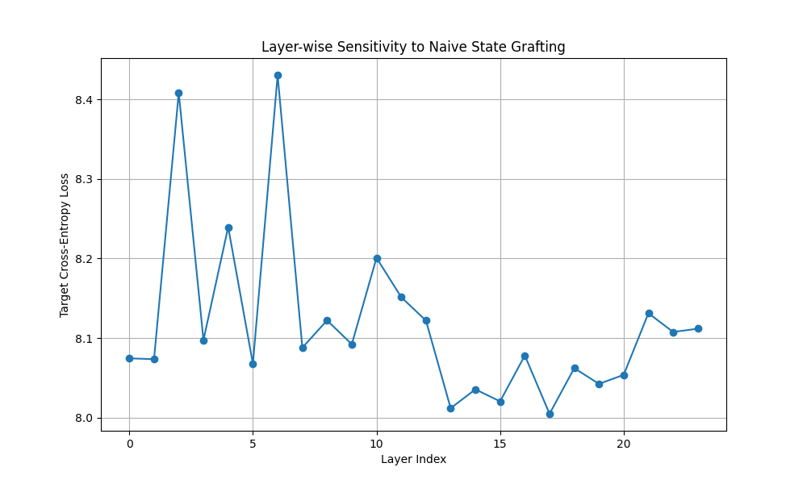
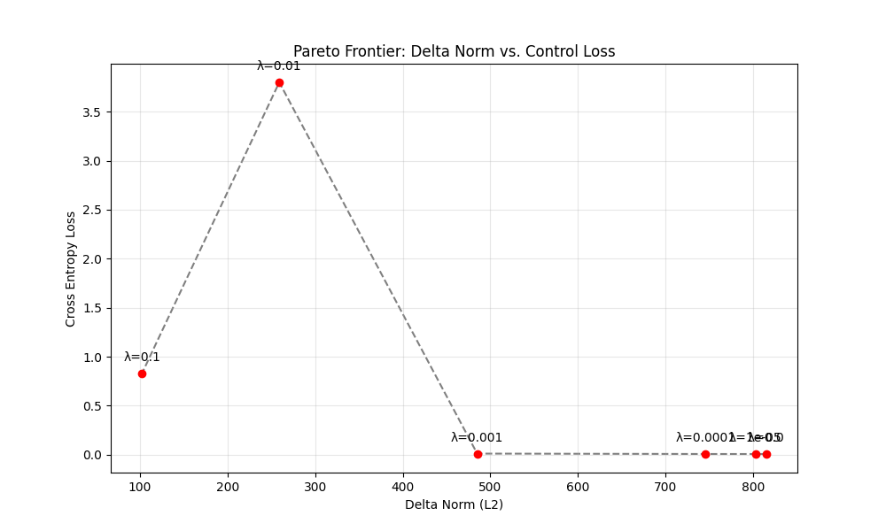

# Augmented Latent State Injection (ALSI)

This repository contains the implementation, experimental history, and final verification of the ALSI project. The goal was to determine if deterministic semantic control of Mamba-2 State Space Models is possible via direct recurrent state grafting.

## Key Visualizations

### 1. The Failure of Linearity (Sensitivity Scan)

*This plot demonstrates that naive, linear state mixing ($h_{new} = h_{old} + h_{fact}$) has almost no effect on the model's output across all 24 layers. The curve is flat/noisy, falsifying the hypothesis that semantic control is a simple linear addition.*

### 2. The Cost of Control (Pareto Frontier)

*This plot shows the trade-off between the magnitude of the injected delta ($||\Delta h||$) and the success of the control (Cross Entropy Loss). Achieving low loss requires large, off-manifold deltas that are actively resisted by the model's natural dynamics.*

---

## Technical Summary

See `docs/reports/FINAL_REPORT.md` for the comprehensive research memo.

### 1. The "Two-System" Discovery
Our experiments reveal that Mamba-2 operates as two coupled systems:
*   **System 1 (Logit Surface):** A fast, locally steerable predictor. We successfully hijacked this using our **Phi Projector**, achieving **Rank 1** for target tokens.
*   **System 2 (Trajectory Validator):** A slow, semantic consistency check. This system "rejected" our injections in Phase 3, leading to the model generating refusal text ("I'm not sure...") despite predicting the target token correctly.

### 2. Validated Architecture: The Phi Projector
We proved that semantic control is **non-linear**. A simple 3-layer MLP (Phi) can learn to map `(State, Target)` $\rightarrow$ `Delta` to force specific outputs.
*   **Performance:** Rank 1-5 on training targets.
*   **Generalization:** Successfully steered unseen tokens (`PINK`) based on semantic proximity to training data.

---

## Repository Structure

*   `core/`: Shared infrastructure (Task base class, Phi model, Utils).
*   `tasks/`: Implementation of specific experiments.
    *   `sensitivity.py`: Phase 1 Layer-wise sensitivity scan.
    *   `phi_training.py`: Phase 2 Ground truth generation and Phi Projector training.
    *   `robustness.py`: Phase 3 Zero-shot generalization and stability tests.
*   `docs/`: Project blueprint and technical reports.
*   `Archive/`: Historical scripts and notebooks.

## Quick Start

Run the full experimental pipeline:

```bash
python ALSI/main.py --task all
```

Or run specific segments:

```bash
python ALSI/main.py --task sensitivity    # Generates Sensitivity Curve
python ALSI/main.py --task failed_linear  # Reproduces PCA failures
python ALSI/main.py --task train_phi      # Trains the Phi Projector
python ALSI/main.py --task robustness     # Tests Zero-Shot & Refusal
```

To generate the plots locally without running the full pipeline, use the provided notebook: `ALSI_Plots.ipynb`.
